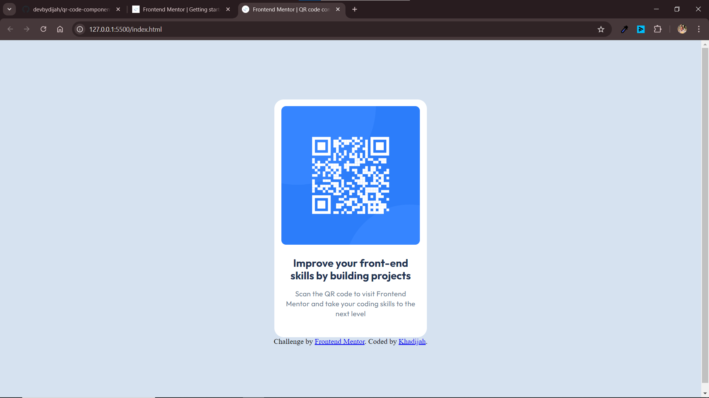

# Frontend Mentor - QR Code Component Solution

This is my solution for the [QR code component challenge on Frontend Mentor](https://www.frontendmentor.io/challenges/qr-code-component-iux_sIO_H). Frontend Mentor challenges are designed to help improve coding skills by building real-world projects.

## Table of Contents

- [Overview](#overview)
  - [Screenshot](#screenshot)
  - [Links](#links)
- [My Process](#my-process)
  - [Built With](#built-with)
  - [What I Learned](#what-i-learned)
  - [Continued Development](#continued-development)
  - [Useful Resources](#useful-resources)

## Overview

### Screenshot

This screenshot shows the completed QR code component. The component is centered on the page and includes a QR code image, a heading, and a supporting paragraph. The design is responsive, adapting to different screen sizes.

### Links

- [Solution URL](https://your-solution-url.com) - The repository containing the source code and documentation for the project.
- [Live Site URL](https://your-live-site-url.com) - The deployed version of the project, accessible to users.

## My Process

### Built With

- **Semantic HTML5**: Used for structuring the content in a meaningful way.
- **CSS Custom Properties**: Utilized for maintaining a consistent color scheme.
- **Flexbox**: Employed for centering the QR code component.
- **CSS Grid**: Used for layout purposes.
- **Mobile-first Workflow**: Ensured the design is responsive and looks good on all devices.
- **Google Fonts**: Integrated for custom typography.

### What I Learned

Working on this project reinforced several important concepts:

1. **Semantic HTML5 Markup**  
   Using semantic elements improved the structure and accessibility of the code, making it easier to understand and maintain.

2. **CSS Custom Properties**  
   CSS variables were used to maintain a consistent color scheme throughout the project, making it easier to update and manage colors.

3. **Flexbox**  
   Flexbox was used to center the QR code component both horizontally and vertically, simplifying the layout process.

4. **Mobile-first Workflow**  
   Designing with mobile-first principles ensured that the layout is responsive and looks good on all devices, from mobile phones to desktops.

### Continued Development

To improve my skills, I plan to focus on:

1. **Accessibility**  
   Implementing ARIA roles and attributes to ensure my projects are accessible to all users, including those with disabilities.

2. **Advanced CSS Techniques**  
   Exploring CSS Grid and animations to create more dynamic and engaging designs, enhancing the user experience.

### Useful Resources

- [MDN Web Docs](https://developer.mozilla.org/) – Comprehensive resource for HTML, CSS, and JavaScript documentation. It helped me understand the nuances of CSS custom properties.
- [CSS-Tricks](https://css-tricks.com/) – Helpful articles and guides on CSS techniques and best practices. I found their Flexbox guide particularly useful.